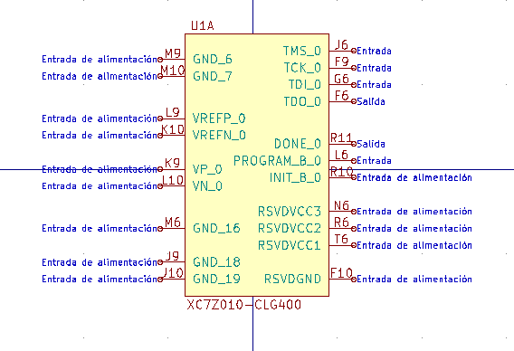
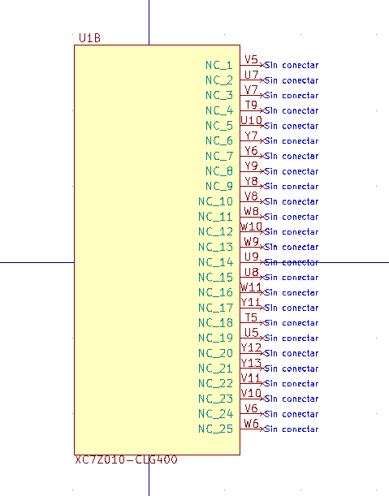
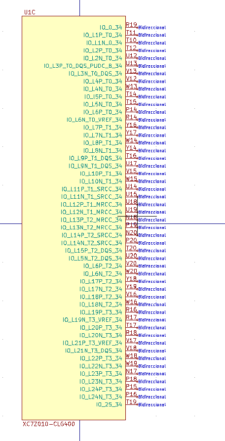
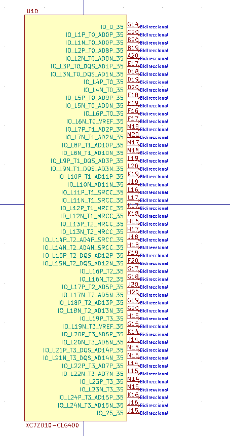
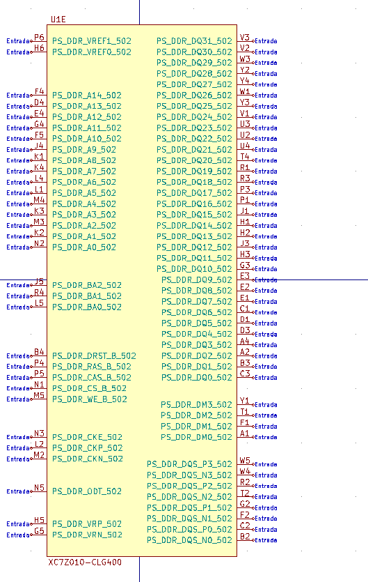
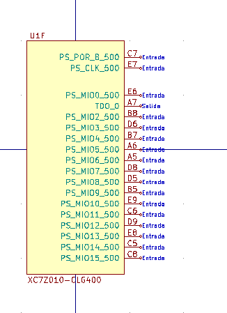
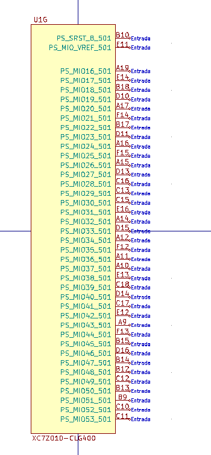
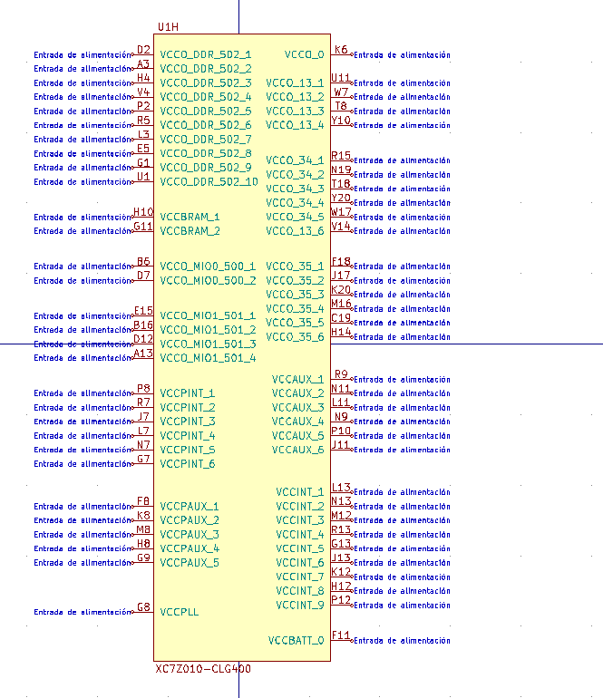
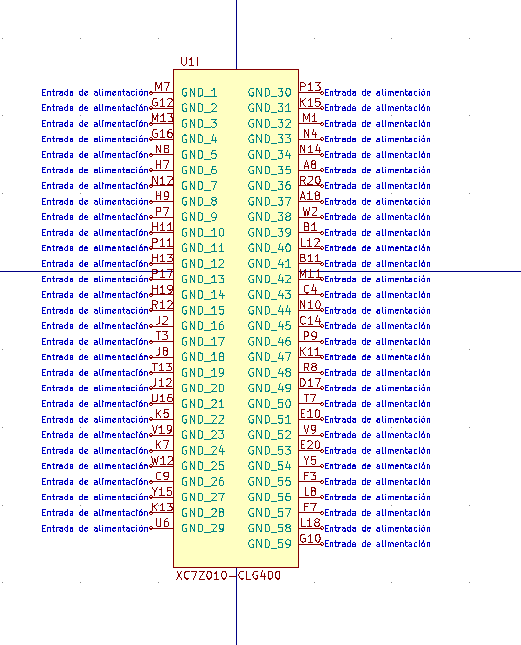
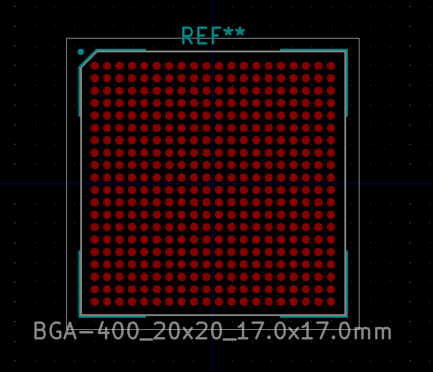

# FPGA_propia
 En este repositorio se subirán los ficheros que permitirán crear una FPGA basada en Zynq-7000

Todo el desarrollo está hecho con KiCad (software libre) para que cualquiera pueda replicarla o mejorarla a su gusto con los ficheros que se van a publicar

## Libreria
El fichero tiene una librería llamada 'Zynq-7000' en la que está el symbol de un XC7Z010 del cual se implementará la versión CLG400 (400 pines en formato de soldadura BGA) 
El símbolo consta de 9 partes, de las que se va a describir su selección a continuación
### - _Símbolo A_

En este símbolo se reflejan los pines de referencia

### - _Símbolo B_

En este símbolo se reflejan los pines que no tienen conexión

### - _Símbolo c_

En este símbolo se reflejan los pines de entrada/salida que se podrán configurar como se quiera

### - _Símbolo D_

En este símbolo se reflejan los pines de entrada/salida que se podrán configurar como se quiera

### - _Símbolo E_

En este símbolo se reflejan los pines que van a ir a la/las memoria ram

### - _Símbolo F_

En este símbolo se reflejan los pines MIO

### - _Símbolo G_

En este símbolo se reflejan los pines MIO continuación de los anteriores

### - _Símbolo H_

En este símbolo se reflejan las alimentaciones de cada parte del integrado

### - _Símbolo I_

En este símbolo se reflejan las masas de todo el integrado

### - *Formato del integrado*

En esta imagen se refleja como es el integrado CLG400 de 400 pines(20x20) para BGA

*** Toda la documentación del frabicante se puede obtener de: ***
https://www.xilinx.com/support/documentation/user_guides/ug865-Zynq-7000-Pkg-Pinout.pdf